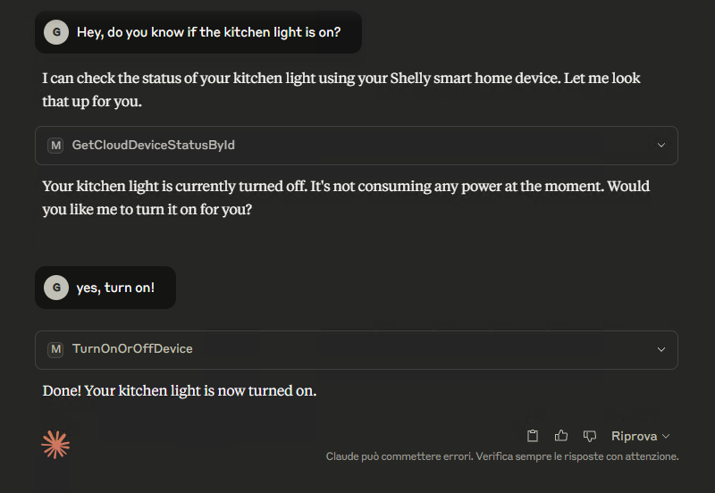
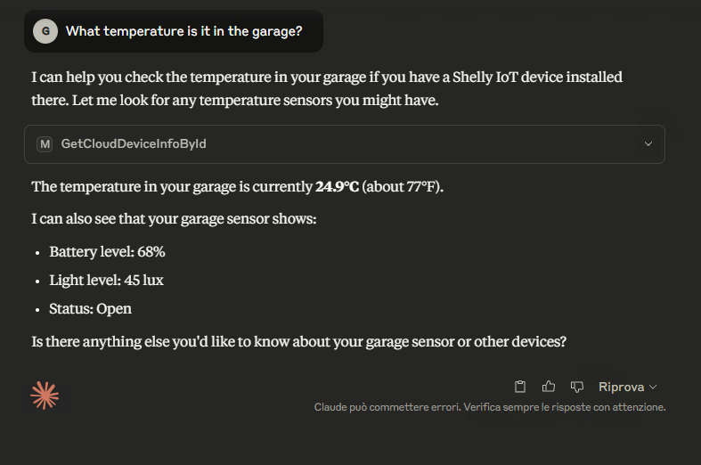

# Shelly MCP Server
MCP Server built in .NET 9 to integrate AI assistants with Shelly Cloud API. 

## Contest winner
> 🏆 **1st place** on category “Crafter” at “[Shelly Smart Home Challenge 2025](https://www.shelly.com/pages/shelly-smart-home-challenge-2025)” 🏆

## Instructions
You can find step-by-step guide to connect this project to your AI assistant on my blog: https://www.thinkasadev.com/en/home-automation-into-your-ai-agent/

## Screenshot
These are some screenshot from my agent Claude (by Anthropic).

 