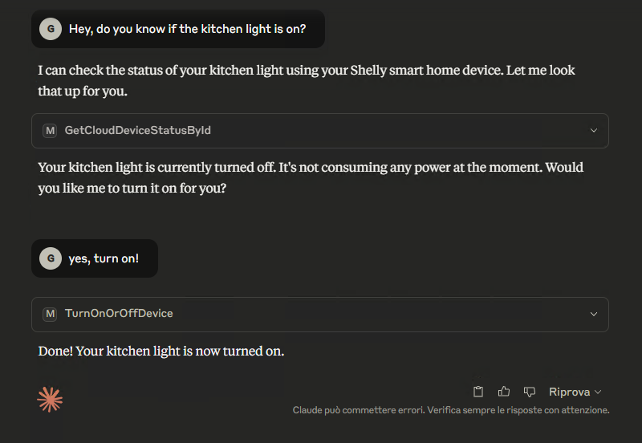

# Shelly MCP Server
MCP Server built in .NET 10 to integrate AI assistants with Shelly Cloud API. 

## Contest winner
> 🏆 **1st place** on category “Crafter” at “[Shelly Smart Home Challenge 2025](https://www.shelly.com/pages/shelly-smart-home-challenge-2025)” 🏆

## Blog post about this project
You can find step-by-step guide to connect this project to your AI assistant on my blog: https://www.thinkasadev.com/en/home-automation-into-your-ai-agent/

## Configuration
### Configuration devices.json
The devices.json file defines which Shelly devices your AI assistant can control. Each device entry requires the following fields:

- **DeviceId**: The unique identifier of your Shelly device. You can find this ID in the Shelly app under device settings (read [blog post](https://www.thinkasadev.com/en/home-automation-into-your-ai-agent/) to know how to get device id).
- **ChannelId**: The channel number for the device (usually 0 for single-channel devices, 0-1 for dual-channel devices).
- **FriendlyNames**: An array of names that the AI assistant will recognize when you refer to this device in prompts. You can include multiple variations like "kitchen", "kitchen light", "luce cucina".
- **DeviceType**: The type of device (e.g., "switch").

#### Example configuration:
```json
[
    {
        "DeviceId": "shellyplus1pm-441793d48064",
        "ChannelId": 0,
        "FriendlyNames": [
            "living room",
            "living room light",
            "salotto",
            "luce salotto"
        ],
        "DeviceType": "switch"
    },
    {
        "DeviceId": "shellyplus2pm-441793d48123",
        "ChannelId": 0,
        "FriendlyNames": [
            "bedroom",
            "camera da letto"
        ],
        "DeviceType": "switch"
    }
]
```

## Execute server with docker
> ⚠️ Docker and docker-compose are required
To run the server using Docker, you need to follow these steps:
1. Create a copy of the Shelly.McpServer/devices.template.json and put it somewhere in your environment, with name "devices.json".
1. Update content of devices.json with your devices (read [blog post](https://www.thinkasadev.com/en/home-automation-into-your-ai-agent/) to know how to get device id)
1. Create a copy of the .env.template file and name it .env.
1. Open the .env file and set the following variables:
	-	**SHELLY_CLOUD_AUTHKEY**: Your Shelly Cloud authorization key (read [blog post](https://www.thinkasadev.com/en/home-automation-into-your-ai-agent/) to know how to get auth key).
	-	**SHELLY_CLOUD_SERVER_URI**: The server URI for Shelly Cloud (e.g., https://shelly-52-eu.shelly.cloud, depends on your account).
Once the .env file is configured, you can start the server with Docker Compose using the following command:
1. Run this command: `docker-compose up -d`

## Integration with Claude Desktop
After starting the Docker container, you need to configure Claude Desktop to connect to your MCP server. Add the following configuration to your Claude Desktop config file:

**Windows**: `C:\Users\[username]\AppData\Roaming\Claude\claude_desktop_config.json`

Add this entry to the `mcpServers` section:
```json
{
  "mcpServers": {
    "shelly-mcp-server": {
      "command": "docker",
      "args": [
        "attach",
        "shelly-cloud-mcp-server"
      ]
    }
  }
}
```

**Note**: Make sure the Docker container is running before starting Claude Desktop, as Claude will try to connect to the MCP server on startup.

## Screenshot
These are some screenshot from my agent Claude (by Anthropic).


