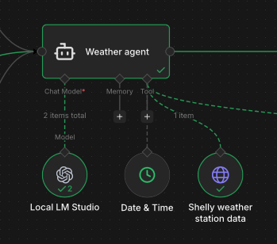

# Shelly integration (MCP + REST API)

Integration project that connects Shelly Cloud to anything in the world!

The project provides two independent components that you can run as containers:
- **[MCP Server](docs/mcp-server.md)** — exposes MCP server for AI assistants
- **[REST API Gateway](docs/rest-api.md)** — exposes REST Api for dashboards, home automation platforms, and any REST-capable client

⬆️ _Usage example of this API project as n8n agent tool_

> 🏆 **1st place** in the "Crafter" category at the **[Shelly Smart Home Challenge 2025](https://www.shelly.com/pages/shelly-smart-home-challenge-2025)** 🏆

## Startup
You can find these projects on docker hub and docker-compose in docker directory.

- If you want to startup MCP server [read this doc (run with docker section)](./docs/mcp-server.md).

- If you want to startup API rest endpoint [read this docs (run with docker section)](./docs/rest-api.md).

## Usage example
- I'm using this project (api) as tool used by **AI agents**, with purpose to get historical/real time data from [Shelly weather station](https://www.shelly.com/it/products/ecowitt-ws90-7-in-1-weather-station)
- Control shelly device from AI Agents (like n8n or OpenClaw 🦞)
- Get information about weather history

## Documentation

- [Project Structure](docs/project-structure.md) — solution layout, purpose and contents of each project
- [MCP Server](docs/mcp-server.md) — configuration, Docker setup, Claude Desktop and Claude Code integration
- [REST API Gateway](docs/rest-api.md) — available endpoints, Docker setup, how to enable or disable the service
- [Device Loading & Store Initialization](docs/device-loading.md) — how the device store is initialized at startup, loading priorities, and merge logic between the local file and the Shelly Cloud API

## Security

This project doesn't implement security token or auth because it's designed to run into a protected environment and not exposed to external world.

### Device mapping file

[`docs/resources/template/devices.template.json`](docs/resources/template/devices.template.json) is the JSON template to define your devices locally. It maps physical device IDs to friendly names used by the MCP tools and REST endpoints. Copy and fill it in to use a local mapping file (see `DeviceMappingFile` configuration key).

## Changelog

See [CHANGELOG.md](CHANGELOG.md) for the full version history.

## License

This project is licensed under the **[GNU GPL v3](LICENSE)**.

1. Anyone can copy, modify and distribute this software.
2. You have to include the license and copyright notice with each and every distribution.
3. You can use this software privately.
4. You can use this software for commercial purposes.
5. If you dare build your business solely from this code, you risk open-sourcing the whole code base.
6. If you modify it, you have to indicate changes made to the code.
7. Any modifications of this code base MUST be distributed with the same license, GPLv3.
8. This software is provided without warranty.
9. The software author or license can not be held liable for any damages inflicted by the software.
