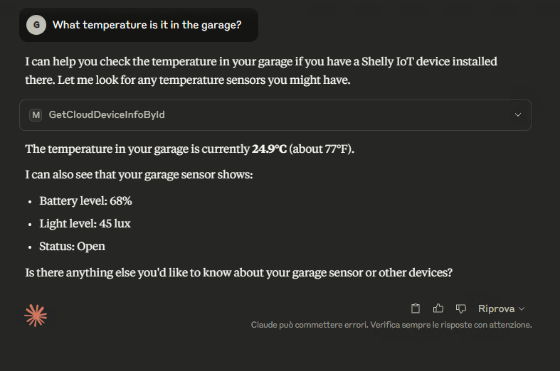

# Shelly MCP Server

MCP Server built in .NET 10 that exposes your Shelly Cloud devices as tools for AI assistants (Claude Desktop, Claude Code, and any MCP-compatible client).

---

## How it works

The server communicates over **stdio** using the Model Context Protocol. When launched by an AI client (e.g. Claude Desktop), it reads your `devices.json` mapping and uses the Shelly Cloud API to let the AI query and control your devices in natural language.

> ℹ️ Here you can find a step-by-step guide to connecting this project to your AI assistant: https://www.thinkasadev.com/en/home-automation-into-your-ai-agent/

---

## Available MCP tools

| Tool | Description |
|------|-------------|
| `GetDevices` | Returns the list of configured devices |
| `GetCloudDeviceStatusById` | Gets the live status of a device by friendly name |
| `GetCloudDeviceInfoById` | Gets extended info (battery, watt, temperature, lux, status) |
| `TurnOnOrOffDevice` | Turns a switch/light on or off (with optional auto-revert delay) |
| `GetWeatherStationStatistics` | Retrieves historical temperature/humidity data for a weather station |
| `GetPowerConsumptionStatistics` | Retrieves historical energy consumption data for a power-metering device |

---

## Configuration

### devices.json

> ⚠️ This file is required

The `devices.json` file maps Shelly Cloud device IDs to human-readable names that you can use in the chat (example "kitchen light"). Create it from the provided template (`devices.template.json`).

Each entry requires:

- **DeviceId**: The unique Shelly Cloud device identifier (find it in the Shelly app under device settings — see the [blog post](https://www.thinkasadev.com/en/home-automation-into-your-ai-agent/) for a step-by-step guide, or get it from the Shelly phone app).
- **ChannelId**: The channel number (usually `0` for single-channel devices or `0`/`1` for dual-channel).
- **FriendlyNames**: An array of names the AI will recognise. Include synonyms and translations as needed.
- **DeviceType**: The device category (e.g. `"switch"`).

```json
[
    {
        "DeviceId": "shellyplus1pm-441793d48064",
        "ChannelId": 0,
        "FriendlyNames": [
            "living room",
            "living room light",
            "salotto",
            "luce salotto"
        ],
        "DeviceType": "switch"
    },
    {
        "DeviceId": "shellyplus2pm-441793d48123",
        "ChannelId": 0,
        "FriendlyNames": [
            "bedroom",
            "camera da letto"
        ],
        "DeviceType": "switch"
    }
]
```

### Environment variables

| Variable | Description |
|----------|-------------|
| `SHELLY_API_KEY` | Your Shelly Cloud authorisation key |
| `SHELLY_API_ENDPOINT` | Your Shelly Cloud server URI (e.g. `https://shelly-52-eu.shelly.cloud`) |
| `DeviceMappingFile` | Path to your `devices.json` file |

See the [blog post](https://www.thinkasadev.com/en/home-automation-into-your-ai-agent/) for instructions on retrieving your API key and endpoint.

---

## Run with Docker

> Docker and Docker Compose are required.

1. Copy `docs/resources/template/devices.template.json` to a location of your choice and rename it `devices.json`. Fill in your devices.
2. Copy `docker/.env.template` to `docker/.env` and set `SHELLY_API_KEY` and `SHELLY_API_ENDPOINT`.
3. In `docker/docker-compose.yml`, update the volume path for `devices.json` to match your environment.
4. Start the MCP server:

```bash
docker-compose up -d shelly-cloud-mcp-server
```

The container exposes port `80` and keeps `stdin` open for the MCP stdio transport.

---

## Integration with Claude Desktop

After starting the container, add the following entry to your Claude Desktop configuration file:

**Windows:** `C:\Users\[username]\AppData\Roaming\Claude\claude_desktop_config.json`

**macOS:** `/Users/[username]/Library/Application Support/Claude/claude_desktop_config.json`

```json
📄 claude_desktop_config.json

{
  "mcpServers": {
    "shelly-mcp-server": {
      "command": "docker",
      "args": [
        "attach",
        "shelly-cloud-mcp-server"
      ]
    }
  }
}
```

> ⚠️ Make sure the Docker container is running before starting Claude Desktop, as the client connects to the MCP server at startup.

---

## Integration with Claude Code

Claude Code supports MCP servers natively. Add the server to your Claude Code MCP configuration:

```json
{
  "mcpServers": {
    "shelly-mcp-server": {
      "command": "docker",
      "args": [
        "attach",
        "shelly-cloud-mcp-server"
      ]
    }
  }
}
```

You can add this to your project-level or user-level Claude Code settings. Once configured, Claude Code can query and control your Shelly devices directly from the terminal.

---

## Screenshots

Examples of the MCP server in action with Claude:



